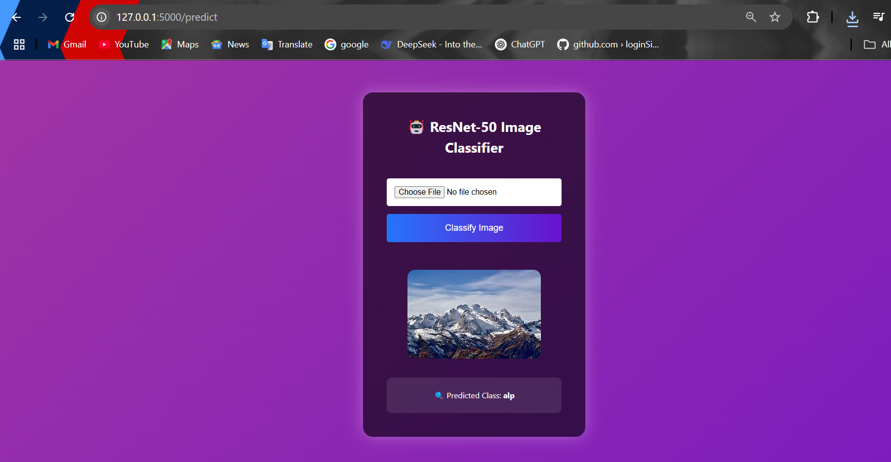
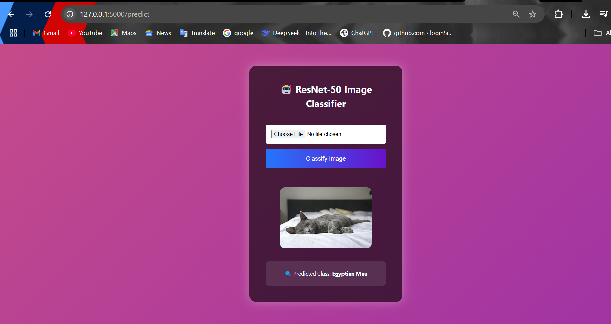
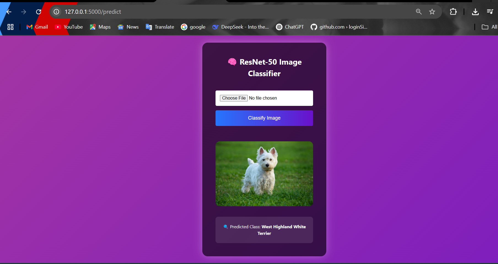

## 📸 ResNet-50 Image Classifier

<p align="center">
  
  
  
  
</p>

<p align="center">
  
</p>

---

## ⭐ About the Project

This is an advanced web-based **image classification application** built with **Flask** and powered by the pretrained **ResNet-50 deep learning model** from **PyTorch**. The model is trained on the **ImageNet dataset**, which includes **1000+ diverse object categories** ranging from animals and vehicles to flowers, instruments, and more.

The frontend is designed with **custom CSS3 animations**, clean layout, and modern UI features — making it an interactive and beautiful deep learning demo.

---

## 🌟 Key Features

- 🚀 Real-time image prediction using ResNet-50
- 📂 Upload any image locally and preview before classification
- 🎨 Animated, responsive UI with advanced CSS effects
- 📊 Displays top predicted class from 1000 ImageNet categories
- 📸 Works great with images of flowers, animals, objects, and more
- 🌐 Fully browser-accessible without needing external APIs

---

## 🎯 Example Results

| Example 1 | Example 2 | Example 3 |
|----------|----------|----------|
|  |  |  |

---

## 📁 Project Structure
```bash
resnet50-image-classifier/
│
├── static/
│   ├── css/
│   │   └── styles.css
│   ├── images/
│   │   ├── result1.png
│   │   ├── result2.png
│   │   └── result3.png
│   ├── uploads/
│
├── templates/
│   └── index.html
│
├── app.py
├── main.py
├── requirements.txt
└── README.md
```
## 🧪 How It Works
User uploads an image via the UI.

Flask saves it and preprocesses using torchvision.transforms.

The image is passed to a pretrained ResNet-50 model.

Model outputs probabilities for 1000 classes.

Top predicted class label is shown with a clean UI.

## ⚙️ Getting Started
1. Clone the Repository
```
git clone https://github.com/YOUR_USERNAME/resnet50-image-classifier.git
cd resnet50-image-classifier
```
2. Create a Virtual Environment
 ```
python -m venv venv
source venv/bin/activate  # or venv\Scripts\activate on Windows
```
4. Install Dependencies
```
pip install -r requirements.txt
```
5. Run the Flask App
```
python app.py
Now, visit http://127.0.0.1:5000 in your browser!
```
## 🧾 Requirements

Your requirements.txt might look like:
```
Flask==2.2.5
torch==2.0.1
torchvision==0.15.2
Pillow==10.0.0
requests==2.31.0
```
### 📚 Tech Stack
Layer	Technology
Backend	Python, Flask
Model	ResNet-50 (TorchVision)
Frontend	HTML5, CSS3, Custom Animations
Deployment	Localhost (Flask)

## 📜 License
This project is licensed under the MIT License - see the LICENSE file for details.

### 🙌 Acknowledgments
🔗 PyTorch ResNet Models

🔗 ImageNet Class Labels

🔗 Flask Documentation

🎨 Emojis and Icons by Emojipedia

### 🌈 Screenshots UI Snapshot
<p align="center">    </p>

### 💡 Future Improvements
✅ Display top-5 predictions with confidence

🌐 Add live hosting via Heroku or Render

🎙️ Integrate voice feedback for predictions

📱 Build a mobile-friendly layout with Bootstrap

### ⭐ Show Your Support
If you liked this project, consider:

⭐ Starring the repo

🧩 Forking it

📢 Sharing it with friends
